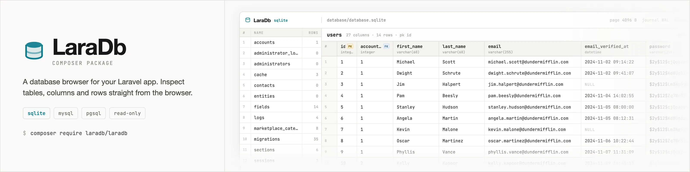

# LaraDb

[](https://github.com/monicahq/laradb/actions/workflows/tests.yml)
[](https://github.com/monicahq/laradb/actions/workflows/integration.yml)
[](https://github.com/monicahq/laradb/actions/workflows/static.yml)
[](https://packagist.org/packages/monicahq/laradb)
[](LICENSE)

A read-only database browser you drop into a Laravel application.

Install it, open `/db`, and get your tables on the left and their rows on the
right — a small phpMyAdmin, without the server, the login screen, or the
write access.

Works with **MySQL / MariaDB**, **PostgreSQL** and **SQLite**.

The page ships its own CSS and JavaScript. No build step, no Tailwind, no
Alpine, no CDN: the only remote request is a webfont, and the layout is intact
without it. Publishing the views with `--tag=laradb-views` gives you the whole
thing in one file to edit.

---

## ⚠️ Read this before you install it

LaraDb renders the contents of your database in a web page. Every row of every
table, to anyone who can reach the URL.

- **Install it with `composer require --dev`.** A production deploy running
  `composer install --no-dev` then never ships the viewer at all.
- **It is disabled outside the `local` environment by default.** Turning it on
  anywhere else is an explicit decision you have to make.
- **Never expose it without authentication and authorisation.** The default
  middleware stack is `['web', 'auth']`, which is the bare minimum — any
  logged-in user passes it. Add a gate (see [Who can reach it](#who-can-reach-it)).
- **Do not enable it on a database holding personal or otherwise sensitive
  data** unless access is strictly controlled. There is no column masking, no
  redaction and no audit log in v1.
- It never writes: the routes are `GET` only and the package issues nothing but
  `SELECT` statements. That protects your data from corruption, not from being
  read by the wrong person.

---

## Installation

Install it as a **development dependency**:

```bash
composer require --dev monicahq/laradb
```

The service provider is auto-discovered. In a `local` environment, that is all
you need: visit `/db`.

Publish the config to change anything:

```bash
php artisan vendor:publish --tag=laradb-config
```

The views can be published too, if you want to restyle them:

```bash
php artisan vendor:publish --tag=laradb-views
```

## Usage

Simply go to `/db` URL in your project, and the screen will shown. You can
configure this URL - see section below.

## Configuration

`config/laradb.php`:

| Key | Default | What it does |
| --- | --- | --- |
| `enabled` | `null` | `null` means "only in `local`". Set `true`/`false` (or `LARADB_ENABLED`) to decide explicitly. |
| `route_prefix` | `'db'` | Where the viewer is mounted. |
| `middleware` | `['web', 'auth']` | The middleware stack applied to both routes. |
| `connection` | `null` | The connection to browse, as named in `config/database.php`. `null` uses the default one. |
| `per_page` | `25` | Rows per page. |
| `max_cell_length` | `120` | Long values are truncated to this many characters, full value in the tooltip. `0` disables it. |

Each has an environment variable: `LARADB_ENABLED`, `LARADB_ROUTE_PREFIX`,
`LARADB_CONNECTION`, `LARADB_PER_PAGE`, `LARADB_MAX_CELL_LENGTH`.

## Who can reach it

Three separate things decide that. They are a stack, not alternatives: each is
a place the viewer can be stopped, and they fail independently. The warning at
the top of this file names them; here is how to set each one.

**1. Whether it is installed at all.** `composer require --dev` keeps LaraDb
out of a production build entirely — `composer install --no-dev` on deploy and
there is no package, no service provider, no route to protect. Nothing else
here is as strong, because nothing else here can be misconfigured.

**2. Whether the routes are registered.** `enabled` is `null` by default, which
means "only in `local`". A staging or production box has no `/db` even if the
package did end up in the build. Turning it on anywhere else is a deliberate
act, and it is the point at which layer 3 stops being optional:

```env
LARADB_ENABLED=true
```

**3. Who gets past the middleware.** This is the one you have to write. The
default stack is `['web', 'auth']`, which only proves the visitor is *someone* —
every logged-in user of your application passes it, including the test account
you made six months ago. Put an authorisation check on top:

```php
// app/Providers/AppServiceProvider.php
use Illuminate\Support\Facades\Gate;

public function boot(): void
{
    Gate::define('viewLaraDb', function ($user) {
        return $user->is_admin;   // whatever "may read the database" means here
    });
}
```

```php
// config/laradb.php
'middleware' => ['web', 'auth', 'can:viewLaraDb'],
```

The stack applies to the whole route group, so the page, the HTML fragment and
the JSON endpoint are all behind the same gate. A user who fails it gets a 403.

### What is not one of the three

`route_prefix` moves the viewer; it does not hide it. A URL is not a secret: it
turns up in access logs, browser history, `Referer` headers and whatever error
tracker you have installed, and it is one shoulder-surf from being public. Set
it because `/db` collides with a route of your own, or to keep LaraDb out of the
way — not to a random string you then count as a layer of defence.

## Routes

Both routes are named and `GET` only.

| Route | Name | Returns |
| --- | --- | --- |
| `GET /db` | `laradb.index` | The full page. `?table=` selects a table, `?page=` a page. |
| `GET /db/tables/{table}` | `laradb.table` | The rows of one table, as an HTML fragment. |

The fragment endpoint also speaks JSON, with `?format=json` or an
`Accept: application/json` header:

```json
{
  "table": "users",
  "columns": [
    {"name": "id", "type": "integer", "nullable": false, "primary_key": true, "default": null, "foreign_key": null},
    {"name": "account_id", "type": "integer", "nullable": true, "primary_key": false, "default": null, "foreign_key": "accounts.id"}
  ],
  "rows": [{"id": 1, "account_id": 3, "name": "Ada"}],
  "page": 1,
  "per_page": 25,
  "total": 42,
  "last_page": 2,
  "sql": "SELECT * FROM \"users\" LIMIT 25 OFFSET 0",
  "duration_ms": 0.42
}
```

## Using the core without Laravel

The reading side depends on nothing but PDO, so it works anywhere:

```php
use LaraDb\DriverFactory;

$pdo = new PDO('sqlite:database.sqlite');
$driver = DriverFactory::fromPdo($pdo);

foreach ($driver->listTables() as $table) {
    echo $table->name, "\n";
}

$page = $driver->getRows('users', page: 2, perPage: 25);
```

`DriverInterface` is the package's public contract:

```php
// Reading
public function listTables(): array;                                     // TableInfo[]
public function getColumns(string $table): array;                        // ColumnInfo[]
public function getRowCount(string $table): int;
public function getRows(string $table, int $page, int $perPage): TablePage;
public function name(): string;

// Describing — everything the chrome is built from
public function serverVersion(): ?string;
public function databaseName(): ?string;      // the db name, or the sqlite file
public function sizeInBytes(): ?int;
public function indexCount(): ?int;
public function metadata(): array;            // engine settings, in display order
public function getForeignKeys(string $table): array;  // column => "table.column"
public function describe(): DatabaseInfo;     // all of the above, gathered once
public function queryCount(): int;
```

The describing half is nullable throughout, and deliberately so: reading a
system catalogue is a privilege. A connection whose user cannot do it gets a
working viewer with a quieter header, never a 500.

What each engine reports for `metadata()`:

| | Keys |
| --- | --- |
| SQLite | `page`, `journal`, `enc`, `fk`, `schema` |
| MySQL | `engine`, `charset`, `collation` |
| PostgreSQL | `enc`, `collation`, `schema` |

Any change to `DriverInterface` is a breaking change and gets a major version
bump.

## Testing

```bash
composer test          # Pint, PHPStan and PHPUnit
composer test:unit     # PHPUnit only
```

The unit and feature suites run on in-memory SQLite and need nothing installed.
The MySQL and PostgreSQL suites skip themselves unless a server is reachable;
point them at one with `LARADB_MYSQL_DSN` / `LARADB_PGSQL_DSN` (plus the
matching `_USERNAME` and `_PASSWORD`). CI runs them against real services on
every push.

## Contributing

Bug reports and pull requests are welcome. Please keep Pint and PHPStan green.

## Changelog

Releases and their notes are generated by
[semantic-release](https://github.com/semantic-release/semantic-release) from
the commit history. See the
[releases page](https://github.com/monicahq/laradb/releases).

## License

MIT. See [LICENSE](LICENSE).
